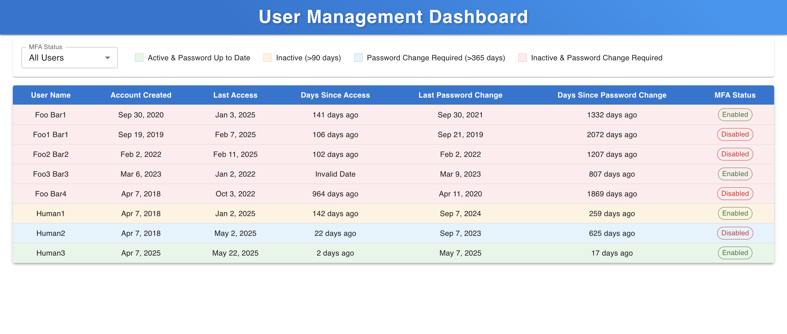

# User Management Dashboard

A full-stack application built with Go (backend) and React (frontend) that displays and manages user data from an Excel file, featuring MFA status filtering and password/access monitoring.



## Tech Stack

### Backend
- Go 1.x
- Gin Web Framework
- excelize (for Excel file handling)

### Frontend
- React with TypeScript
- Vite
- Material-UI (MUI)
- date-fns

## Setup Instructions

1. Clone the repository:
   ```bash
   git clone git@github.com:ParthShahAtStonyBrook/TestAssignment.git
   cd TestAssignment
   ```

2. Backend Setup:
   ```bash
   # Install Go dependencies
   go mod download
   ```

3. Frontend Setup:
   ```bash
   cd frontend
   npm install  
   ```

4. Data Setup:
   - Place your Excel file in the `data` directory
   - Ensure the file is named "Spec for IAM, Service users.xlsx"
   - Verify the Excel file follows the required column structure

## Running the Application

1. Start the Backend (from project root):
   ```bash
   go run main.go
   ```
   The backend server will start on http://localhost:8081

2. Start the Frontend (in a new terminal):
   ```bash
   cd frontend
   npm run dev   
   ```
   The frontend will be available at http://localhost:5173

## Design and Architecture Notes

### Backend Design
- **Framework Choice**: Gin was chosen for its high performance and simplicity
- **CORS Configuration**: Configured to allow local development
- **Date Handling**: 
  - Dates are parsed in local timezone using `time.ParseInLocation`
  - Supports two date formats: "Jan 2 2006" and "Jan 02 2006"
  - Future dates and invalid dates are handled

### Frontend Design
- **UI Framework**: Material-UI for consistent, modern styling
- **State Management**: React hooks for local state management
- **Data Display**:
  - Color-coded rows for different user states
  - MFA status filtering
  - Responsive table design
  - Date formatting with proper timezone handling

### Features
1. **User Status Indicators**:
   - Green: Active & Password Up to Date
   - Yellow: Inactive (>90 days)
   - Blue: Password Change Required (>365 days)
   - Red: Both Inactive & Password Change Required

2. **MFA Status Filtering**:
   - All Users
   - MFA Enabled
   - MFA Disabled

3. **Date Monitoring**:
   - Account creation date
   - Last access tracking
   - Password change tracking

### Design Tradeoffs

1. **Data Storage**:
   - Using Excel file instead of a database for simplicity
   - Trade-off: Limited scalability

2. **Error Handling**:
   - Effective handling of invalid dates and missing data
   - Trade-off: Some data validation is done client-side

3. **Performance**:
   - All data loaded at once
   - Trade-off: May not perform well with very large datasets
